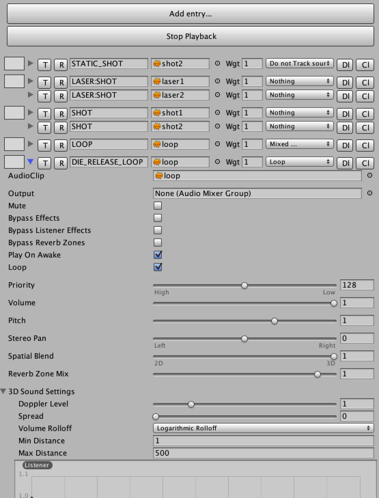

# UberAudio
UberAudio is a free, open-source extension of Unity's audio
system. It organises all your audio into banks, rather than scenes or
prefabs, and audio is triggered through a flexible, loosely coupled
interface.

Although rewritten for Unity, this is the same system we used on
Dungeon Keeper and Fable.

## Core Features
* Audio banks. Edit and organise all your audio without modifying any
  scenes. Mount them into your scenes at runtime.
* Flexible audio triggers. Audio is triggered in code via audio event
  triggers. "AudioManager.Instance.Play("Shot");" will look through
  the mounted audio banks and only trigger some audio if a match is
  found.
* Audio event trigger specialisation. Audio events can be given
  increasing levels of specialisation - "Wolf:Footstep" is more
  specialised than "Footstep". If a specialised event isn't found,
  UberAudio will remove specialisations until it finds a match - this
  allows a coder to programmatically fire off lots of events, and an
  audio designer to honour only the ones he cares about.
* Improved lifetime management. By default, your audio won't die
  immediately when the GameObject it's attached to dies -
  audio cutting rarely sounds good. Similarly, if you've got a looping
  sound the sound will release it's loop on death, and then stop
  naturally.
* Randomness and weightings. Multiple audio events with the same name
  are treated as a group, and triggering such an event will
  automatically pick a random audio event from the group. Individual
  events can be given higher or lower random weighting within their
  group.
* Lightweight. UberAudio is a simple wrapper around Unity's audio
  system, and at any time you can get access to the AudioSource you're
  using.

## Quick Start Guide
* Add the Audio Manager to your scene through
  Assets->UberAudio->Create Audio Manager.
* Create an Audio Bank through Assets->UberAudio->Create Audio
  Bank. Make sure you create it in a resources folder so it can be
  loaded dynamically.
* Click on the new audio bank and add some audio events to it.  
* Mount your audio bank in your scene: Assets->Uber Audio->Audio Bank
Mounter. Change the bank path to the path of your audio bank.
* In code, trigger an audio event through
  AudioManager.Instance.Play("YourEventName"). If you want to trigger
  a 3D sound, attach your audio to a game object through
  AudioManager.Instance.Play("YourEventName", gameObjectToTrack).
* If you have problems, tick some of the debug options on your
AudioManager object - 'Log Bank Loads' and 'Log Event Lookups' are
usually very helpful.

There's also an example project that shows you how to use things.

## Details
### Audio Events and Banks

An 'audio event' is a unit of audio which can be triggered through
AudioManager.Instance.Play(). Audio events are created and stored in
'audio banks', which are mounted in your scene through an
AudioBankMounter.

There are various advantages to organising things in banks:

* Audio can be added, changed, removed without touching any
  scenes. This means you can have your audio designer can work
  independently. 
* Similarly, game code can be written without explicitly touching
  audio sources.
* You can edit all your audio in one place, and group together pieces
of related audio into the same bank.
* And audio clip can be reused multiple times with different settings.
* You can mount or unmount audio banks on demand.
* Moreover, because of the flexible trigger system UberAudio uses,
when you mount a new bank any new audio events that share the same
triggers as existing events are automatically grouped. This means you
can keep an audio bank in memory with a single version of a sound, and
then load/unload banks containing variations on demand - a handy
memory saving trick.

### Audio Event Triggers

To trigger an audio event in a bank you simply call
'AudioManager.Instance.Play()' with the name of the event you want to
trigger. If such a trigger isn't found, nothing is played.

In addition, event triggers can be specialised. An example helps to
explain how this workds and why it's useful.

Imagine a game in which you have lots of different creature types,
each with their own type name stored in 'CreatureName', and you want
to give one of them a unique footstep sound. Obviously, using the
normal event triggers, you could fire off an audio event trigger of
'CreatureName+"Footstep"'. However, that would mean creating a new
trigger in your bank for all of your creatures, with most of them
having the same settings. This is clearly inefficient.

Trigger specialisation solves this common problbem. In your audio bank
you create two audio events, one for the general case and one for your
special case - so "Footstep" and "Wolf:Footstep".  In code you fire
off 'CreatureName + ":" + "Footstep" - the ':' is a special seperation
marker.

Now, when CreatureName is 'Wolf' we'll have an event trigger of
'Wolf:Footstep and there's an exact match for that, which will be
played. However, when you fire off "Goblin:Footstep", it won't
find anything; it then strips off the first specialisation on the left
('Goblin' in this case), and tries again, this time finding
Footstep. Footstep is played, giving you a default sound.

This system works for any number of specialisations, working from left
to right. Thus things 'Wolf:Gravel:Footstep' might be used if you have
different sounds for ground materials.

This is a very handy workflow. It means coders can programmatically
fire off very specific events to the audio system, and audio designers
can quickly create defaults for the most common cases and create more
specialised versions when needed.

Incidentally, obviously using ':' directly in code is horrible;
AudioManager.MakeEvent() exists to make audio specialisation
events. Thus the above would look like 'AudioManager.MakeEvent("Wolf",
"Gravel", "Footstep")'.

### Audio Event Trigger Groups

Multiple event triggers with the same name are automatically grouped
together in UberAudio, creating a trigger group. When an audio event
trigger from a group is played, it will pick a random entry from the
group. By default, all events are given the same weighting in the
randomisation, but if you wish you can weight a given event higher or
lower by changing its weighting in the audio bank.

This allows audio designers to create variations for audio quickly and
easily.

### Audio Event Liftime

When you fire off an audio event in UberAudio, if you want a 3D sound
the second parameter to Play needs to be a GameObject. Any audio
triggered by your event then tracks the position and lifetime of that
GameObject.

Unlike raw AudioSource playback in Unity, however, by default your
audio will not immediately die as soon as the GameObject it's attached
to dies - this is rarely desireable. Instead, it will finish its
playback and then die; if it's a looping sound, it will release it's
loop and then die.

This behaviour can be overridden in the properties mask of an event in
the audio bank.

### Editing Audio Banks
Editing audio banks is fairly simple. Below is a screenshot of what it
looks like:

From left to right, we've got:

* The drag handle. Use this to move audio event groups around.
* A foldout arrow. As you can see at the bottom of the picture,
  opening it up gives you access to the normal Unity audio source
  editor, where you can adjust things as normal.
* 'T' and 'R' stand for 'play This sound' and 'play Random sound'. The
  former plays this event, using the parameters your set up; the
  latter, chooses a random event from the group, using the weighting
  parameters you've set up.
* Next along is the event trigger name. Events with the same trigger
  name will automatically be grouped together.
* Next is the audio clip.
* Next is the random weighting. This can be any number, and is
  relative to the other weights in the group - thus if you have two
  events, one with a weight of 1 and the other 3, the first event has
  a 1 in 4 chance of playing.
* Next is the properties mask. Options here are
    * 'Loop'. Makes the audio source loop.
    * 'Stop playing immediately when source dies'. This makes the
      audio event cut off when the GameObject it's attached to dies.
    * 'Keep looping when when source dies'. By default looping sounds
      release their loop when their source dies, and this stops
      that. Be careful - UberAudio won't be able to kill this audio
      event for you.
    * Do not track source position. Use this if you want an event to
      be fired off at the source objects position, and to track the
      lifetime of the source object, but you want it to stay
      still. Useful for things like footsteps.
* 'Dl'. Deletes an event.
* 'Cl'. Clones an event.

## Installation
* Stick the UberAudio folder somewhere under your Unity project
  Assets folder.
* Create and audio bank via Assets->UberAudio->Create UberAudio Bank.
* Usage examples can be seen in the Examples folder.

## Notes
* Requires Unity 5.1
* Pull requests welcome!

 * * * *

[UberAudio]: https://github.com/bbbscarter/UberAudio
